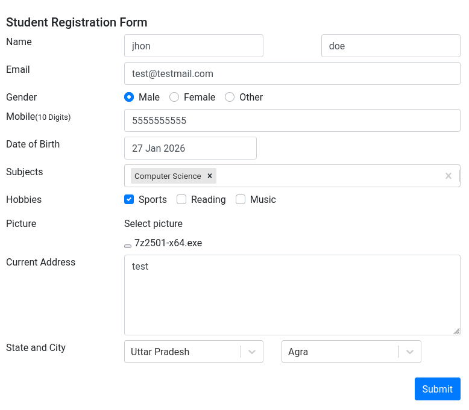
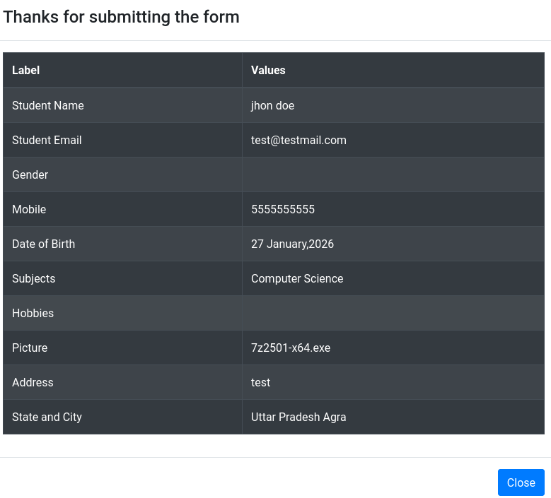

# Bug Report – File upload allows executable (.exe) files without validation

## Bug ID
BUG-DEMOQA-001

## Title
File upload accepts .exe files when it should be restricted

## Application
DemoQA – Automation Practice Form

## Environment
- Platform: Web
- Browser: Chromium-based (Desktop)
- OS: Desktop(Linux)

## Severity
High

## Priority
Medium

## Description
The file upload field allows executable files (.exe) to be uploaded, even though such file types should be restricted for security reasons.

## Preconditions
- User is on the Automation Practice Form page

## Steps to Reproduce
1. Access https://demoqa.com/automation-practice-form
2. Scroll to the file upload field
3. Select a `.exe` file in the file upload field
4. Submit the form

## Expected Result
The system should block the upload and display an error message indicating that the file type is not allowed.

## Actual Result
The `.exe` file is accepted and uploaded successfully.

## Notes
Allowing executable files may pose a security risk in real-world applications and should be prevented through file type validation.

### Evidence

**1. Executable file selected**

**2. Form submitted successfully**
